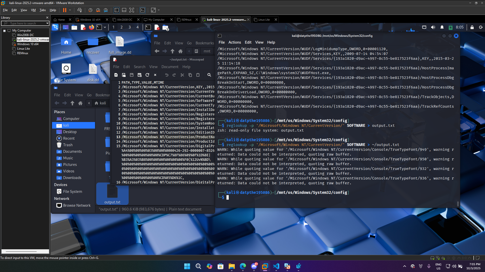
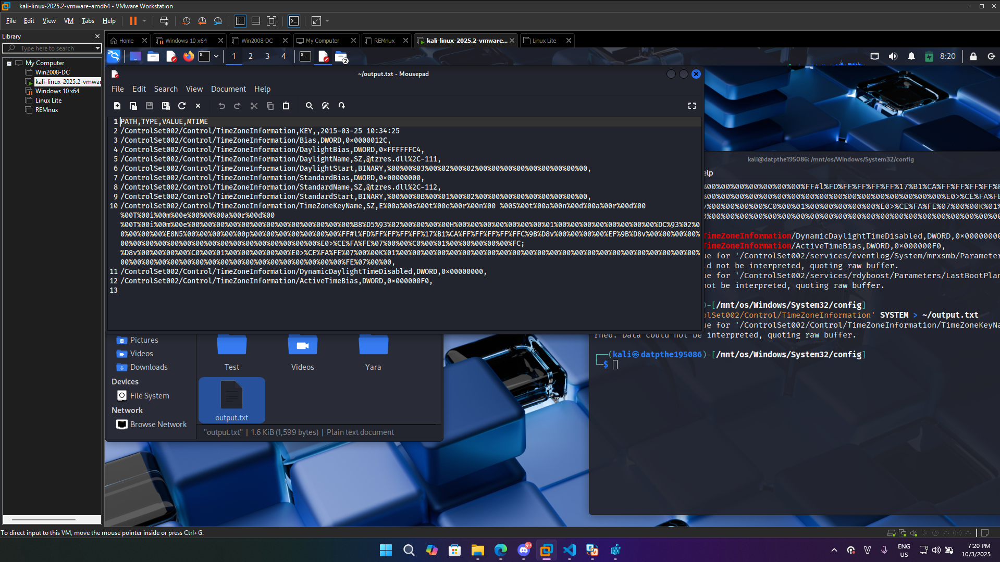
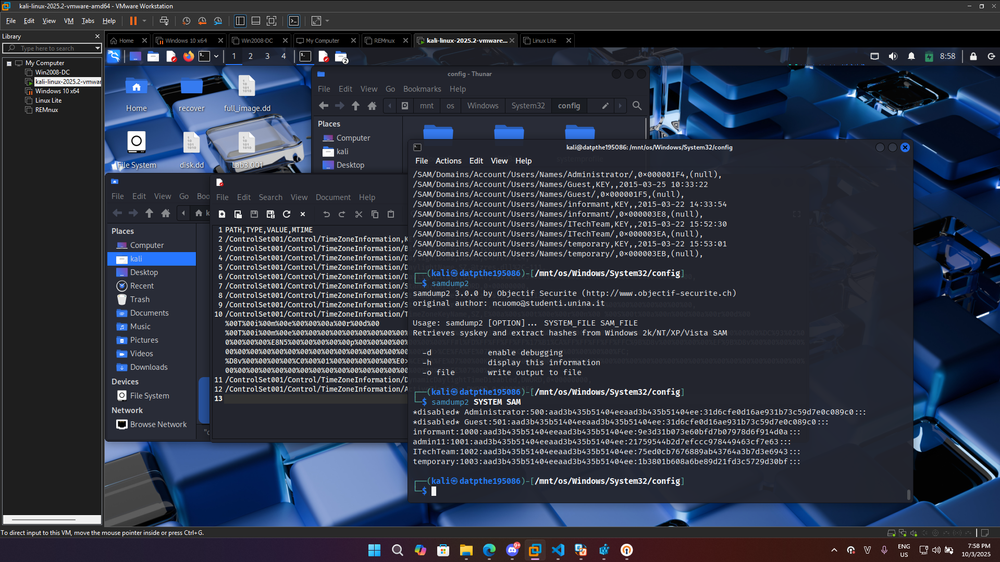

# Lab5 - DatPTHE195086
## Mount disk image
Mount disk image vào kali


## What is the installed OS information in detail?

Dựa vào nghiên cứu, em biết được các file regedit nằm trong đường dẫn: os/Windows/System32/config


Tiếp tục mò sâu thêm, em biết được các thông tin chi tiết về hệ điều hành đã cài đặt nằm tại **HKLM\SOFTWARE\Microsoft\Windows NT\CurrentVersion**

Ở đây em sẽ sử dụng reglookup để lấy thông tin



Lưu output vào file output.txt

Thông tin về hệ điều hành đã cài đặt

## What is the time zone setting?

Tiếp tục nghiên cứu về regedit, em biết được thông tin về múi giờ nằm trong đường dẫn: **HKLM\SYSTEM\CurrentControlSet\Control\TimeZoneInformation**

Do không thể truy cập được vào đường dẫn trên, em đã sử dụng **grep** để tìm kiếm từ khóa **TimeZoneInformation**


Sau khi đã biết vị trí của TimeZoneInformation, em sử dụng reglookup để lấy thông tin

```reglookup -p 'ControlSet002/Control/TimeZoneInformation' SYSTEM > ~/output.txt```



Giải mã thông tin về múi giờ, em sử dụng đoạn code sau:


## What is the computer name?

Computer name nằm trong đường dẫn: **HKLM\SYSTEM\CurrentControlSet\Control\ComputerName\ComputerName**

Sử dụng reglookup để lấy thông tin

```reglookup SYSTEM | grep ComputerName```

## How many accounts does the system have?
Sử dụng reglookup để lấy thông tin về user

```reglookup -p 'SAM/Domains/Account/Users/Names' SAM```


## What are the NTLM password hashes of these accounts?

Vì không thể lấy được NTLM password hashes của các tài khoản thông qua reglookup, em đã sử dụng công cụ **samdump2** để lấy thông tin
```samdump2 SYSTEM SAM```



## What are included in UserAssist?

> https://www.magnetforensics.com/blog/artifact-profile-userassist/

UserAssist là một tính năng trong Windows cho phép theo dõi việc sử dụng các tệp thực thi và ứng dụng do người dùng khởi chạy.

UserAssist được lưu trong NTUSER.DAT

Đường dẫn: **HKCU\Software\Microsoft\Windows\CurrentVersion\Explorer\UserAssist**

Sử dụng reglookup để lấy thông tin của từng user
```reglookup -p 'Software/Microsoft/Windows/CurrentVersion/Explorer/UserAssist' NTUSER.DAT```


Lấy được toàn bộ ứng dụng sử dụng gần đây của người dùng


Do tên các ứng dụng được encode bằng ROT13, em đã sử dụng cyberchef để giải mã


