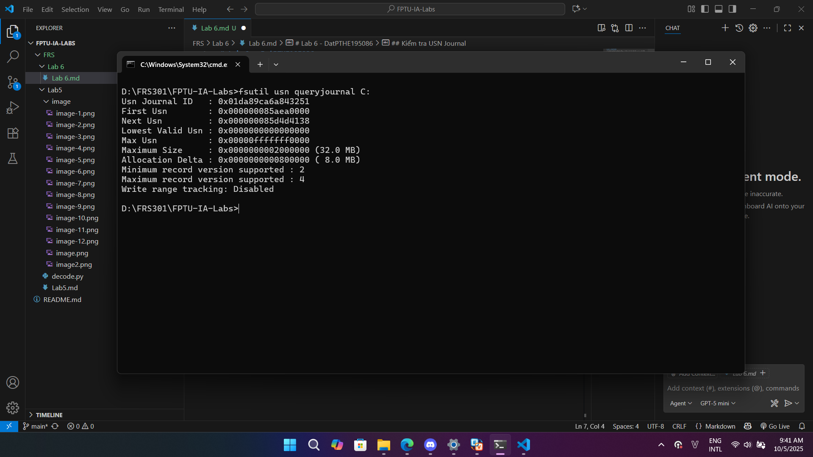
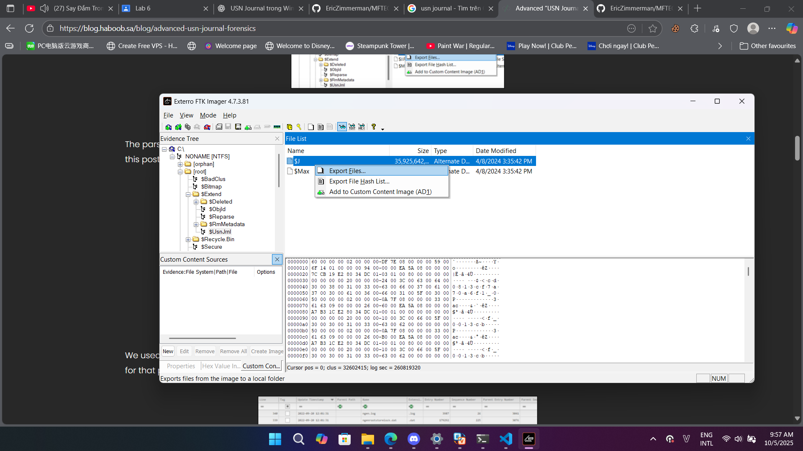
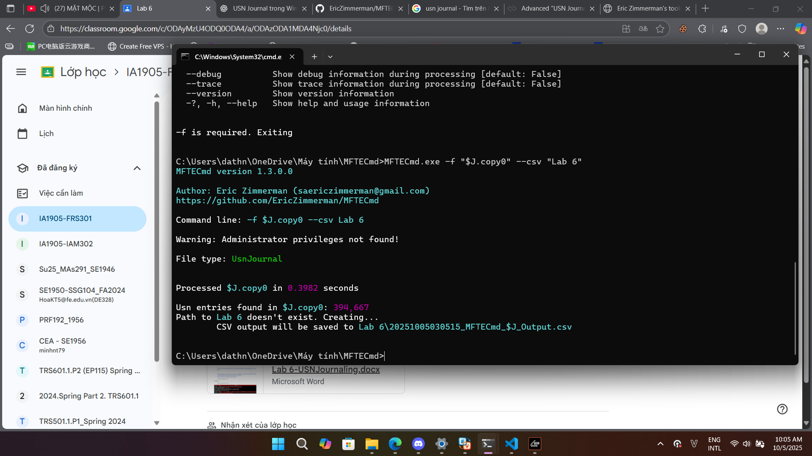
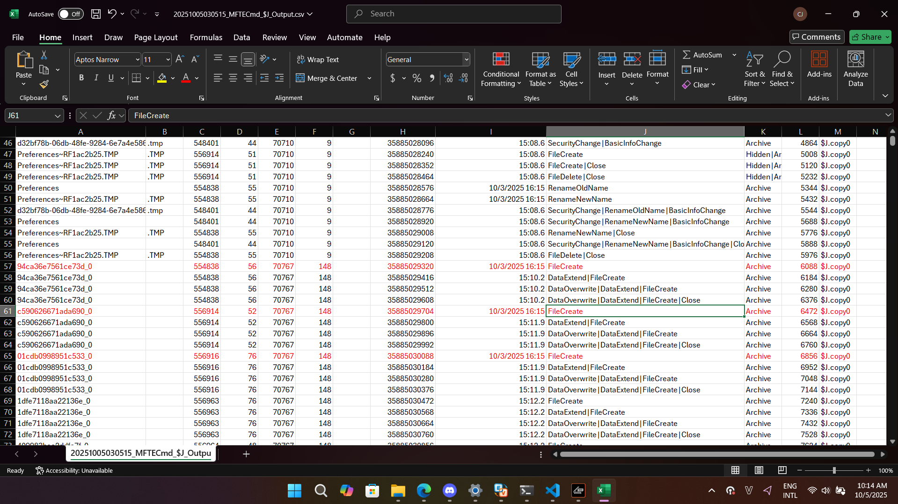
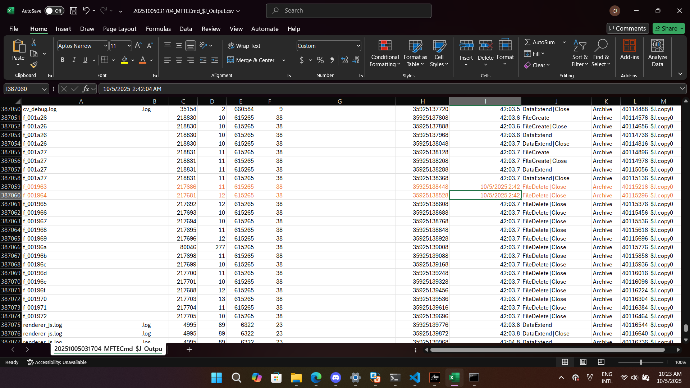
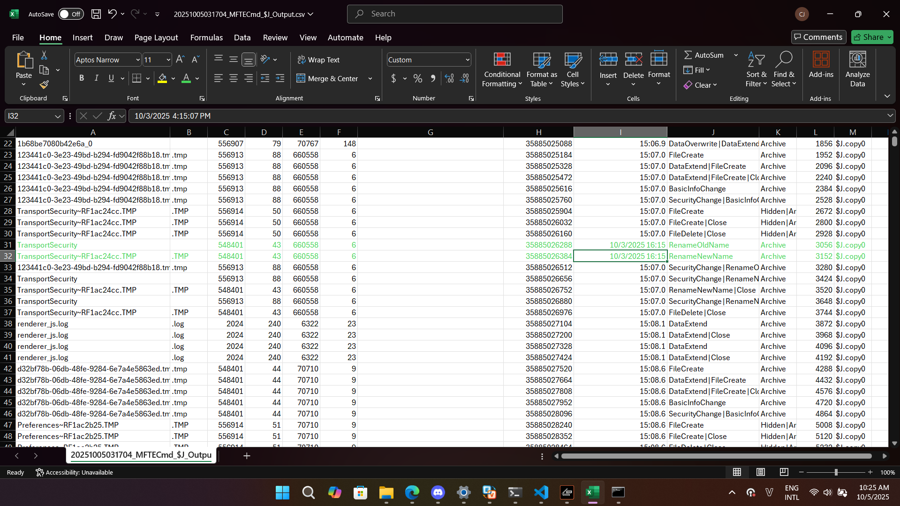

# Lab 6 - DatPTHE195086
## Kiểm tra USN Journal
Ở bài lab này, em sẽ sử dụng máy thật và sử dụng ổ C để thực hiện bởi vì ổ C là ổ hệ thống và có nhiều hoạt động ghi hơn các ổ khác.

Đầu tiên, em sẽ sử dụng lệnh ```fsutil usn queryjournal C:``` để kiểm tra USN Journal trên ổ C. Kết quả trả về như sau:



Như vậy, ta thấy rằng USN Journal đã được kích hoạt trên ổ C.

## Trích xuất USN Journal
Ở đây, em sẽ sử dụng **FTK Imager** để trích xuất USN Journal từ ổ C. Các bước thực hiện như sau:

1. Mở **FTK Imager** và chọn **File** -> **Add Evidence Item**.

2. Chọn **Logical Drive** và nhấn **Next**.

3. Chọn ổ C và nhấn **Finish**.

4. Trong cửa sổ **Evidence Tree**, nhấn chuột phải vào ổ C và trỏ đến **[root]** -> **$Extend** -> **$UsnJrnl**.

5. Chọn thư mục lưu trữ và nhấn **OK**.



Vậy là chúng ta đã lấy được file USN Journal.

## Chuyển sang CSV
Thông qua tra cứu, em có được hướng dẫn sử dụng công cụ **MFTECmd** để chuyển file USN Journal sang định dạng CSV.


## Identify at least three files that were created. Note their timestamps and paths.
Sau khi chuyển đổi file USN Journal sang định dạng CSV, em đã mở file CSV bằng Excel và lọc các cột để tìm các file được tạo mới.

Dưới đây là ba file mà em đã tìm thấy và đánh dấu đỏ, kèm theo timestamp:



Em không rõ tại sao không có path nhưng em đã tìm lại 1 hồi lâu thì path vẫn bị trống.

## Identify at least two files that were deleted. Note their timestamps and paths
Tương tự như trên, em đã lọc các file bị xóa và tìm thấy hai file bị xóa, kèm theo timestamp:


## Find one instance of a file rename operation. What was the old and new name?
Em đã tìm thấy một file bị đổi tên, với tên cũ và tên mới như sau:


Tên cũ: **TransportSecurity**

Tên mới: **TransportSecurity~RF1ac24cc.TMP**